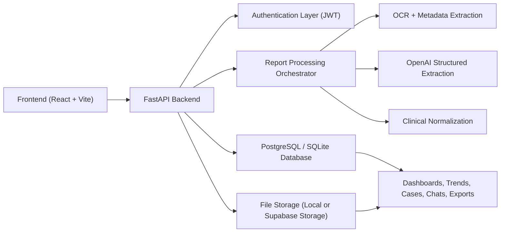
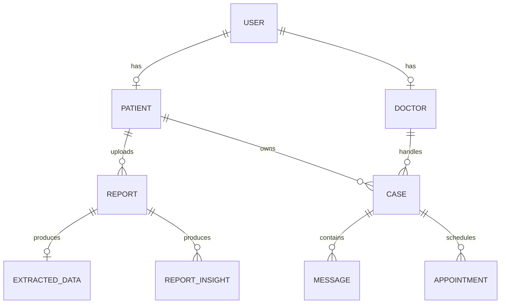

# DoctorCopilot

DoctorCopilot is a full-stack healthcare AI platform that helps patients upload medical reports, helps doctors review clinical cases, and helps admins control the system safely and cost-effectively.

Live product:
- [doctorcopilot.app](https://doctorcopilot.app)
- [www.doctorcopilot.app](https://www.doctorcopilot.app)

## 1. Project In One Simple Paragraph

This project takes a medical report uploaded by a patient, extracts useful information from it, stores the structured medical data, and then reuses that stored data across dashboards, trends, doctor review, chats, appointments, and PDF exports. The important idea is this:

- process once
- store once
- reuse everywhere

That makes the platform faster, cheaper, and easier to maintain than a system that asks AI to regenerate everything on every screen.

## 2. Who This Project Is For

This README is written for:

- beginners who want to understand the full project
- viva or presentation use
- developers who want to run the project locally
- contributors who want to know where code lives
- deployers who want to understand production setup

If you are completely new, also read:
- [vocabulary.txt](C:\Users\thewa\Desktop\Doctorcopilot_finale\guide\vocabulary.txt)
- [introduction.txt](C:\Users\thewa\Desktop\Doctorcopilot_finale\guide\introduction.txt)

## 3. Main Goals Of DoctorCopilot

- help patients understand their medical data better
- help doctors review patient history faster
- reduce repeated AI cost by reusing stored results
- support consultations, chats, appointments, and exports
- support real deployment with Railway, Vercel, and Supabase
- support demo mode when platform AI is turned off

## 4. Main User Roles

### Patient

Patients can:

- register and log in
- upload reports
- view dashboard, trends, timeline, reports, cases, chats, calendar, and settings
- request a consultation with a selected doctor
- approve or deny report-access requests from doctors
- export health summaries
- delete individual reports
- clear their own stored medical data from settings

### Doctor

Doctors can:

- log in using doctor credentials
- review pending consultation requests
- accept, reject, refer, or open cases
- request access to patient reports
- read patient insights and trends
- view linked reports
- export AI and source PDFs
- chat with patients
- schedule appointments

### Admin

Admins can:

- manage doctors
- manage patients
- manage cases
- monitor reports and processing logs
- monitor system status
- turn platform AI on or off
- require password `api123` to re-enable platform AI
- allow or block personal API key usage for individual patients

## 5. High-Level Product Architecture



## 6. What Happens When A Patient Uploads A Report

This is the most important project flow.

1. Patient logs in.
2. Patient uploads a PDF or image report.
3. Backend stores the original file.
4. OCR or direct PDF text extraction reads the report.
5. Metadata like lab name, patient name, dates, and doctor name is extracted.
6. OpenAI converts raw report text into structured medical JSON.
7. Clinical normalization cleans values and standardizes parameters.
8. Structured output is saved in the database.
9. Trends and insights read that stored data later.
10. Doctors can review the same stored output inside cases.

This means:

- no repeated AI cost for old reports
- no repeated OCR cost for old reports
- dashboards and trends are generated from stored data

## 7. Core Design Principle

DoctorCopilot is designed around this rule:

- AI processing should happen only when a new report is uploaded

Everything after that should reuse stored data:

- patient dashboard
- patient trends
- patient timeline
- doctor case view
- doctor insights
- report exports

## 8. Full Functional Areas

### Patient Area

- dashboard
- reports
- timeline
- trends
- consultations / cases
- chats
- calendar
- settings

### Doctor Area

- dashboard
- cases
- case view
- case insights
- chats
- calendar
- settings

### Admin Area

- operational dashboard
- doctor management
- patient management
- case management
- reports monitor
- system status
- AI cost control

## 9. Repository Structure

```text
Doctorcopilot_finale
├─ app/                         FastAPI backend
│  ├─ api/                      REST endpoints
│  │  └─ v1/endpoints/          route handlers
│  ├─ core/                     config, security, exceptions, debug logging
│  ├─ db/                       DB engine, schema helpers, base models
│  ├─ models/                   SQLAlchemy models
│  ├─ schemas/                  Pydantic request/response models
│  ├─ scripts/                  seeding, migration, validation scripts
│  ├─ services/                 business logic
│  │  ├─ ai/                    OpenAI integration
│  │  ├─ export/                PDF exports
│  │  ├─ insights/              trends and insights logic
│  │  ├─ processing/            OCR and report pipeline
│  │  └─ storage/               local or Supabase storage logic
│  └─ websockets/               real-time support
├─ src/                         React frontend
│  ├─ components/               reusable UI pieces
│  ├─ pages/                    route-level pages
│  ├─ services/                 frontend API clients
│  ├─ hooks/                    reusable frontend logic
│  ├─ context/                  theme and shared state
│  └─ lib/                      small frontend helpers
├─ guide/                       all project text guides
├─ tests/                       backend tests
├─ storage/                     local uploaded files in development
├─ Dockerfile                   Railway container deployment
├─ railway.toml                 Railway config
├─ vercel.json                  Vercel SPA routing config
├─ package.json                 frontend deps/scripts
├─ requirements.txt             backend deps
└─ .env.example                 sample environment values
```

## 10. Important Backend Concepts

### `app/api`

This is where URLs are defined. Example:

- login endpoint
- patient routes
- doctor routes
- admin routes
- reports routes

### `app/models`

These are database tables represented in Python code.

Important models include:

- `User`
- `Patient`
- `Doctor`
- `Case`
- `Message`
- `Report`
- `ExtractedData`
- `ReportInsight`
- `Appointment`
- `AppSetting`

### `app/schemas`

These define request and response shapes.

Example:

- what fields are allowed when creating a patient
- what fields are returned when reading a report

### `app/services`

This is the real business logic layer.

Examples:

- authenticate user
- process report
- build patient trends
- create PDF exports
- manage AI control

### `app/core`

This contains system-level code:

- env config
- password hashing
- JWT token helpers
- custom exceptions
- debug logger

## 11. Important Frontend Concepts

### `src/pages`

These are route-level screens.

Examples:

- patient dashboard
- doctor cases
- admin dashboard

### `src/components`

These are reusable UI pieces.

Examples:

- cards
- modals
- layout shells
- banners
- charts

### `src/services`

These connect the frontend to the backend.

Examples:

- login API calls
- report upload
- admin management
- doctor APIs

### `src/hooks`

These help share reusable frontend logic.

Examples:

- chat stream hook
- cached patient dashboard hook

## 12. Main Database Entities

Here is the simple relationship view.



### Key tables

- `users`: login identity, password hash, role
- `patients`: patient-specific profile
- `doctors`: doctor-specific profile
- `reports`: uploaded reports and metadata
- `extracted_data`: structured result from report processing
- `report_insights`: stored AI findings for a report
- `cases`: consultations between patient and doctor
- `messages`: chat messages inside a case
- `appointments`: scheduled appointments
- `app_settings`: system-wide settings like AI on/off

## 13. Authentication System

Authentication is handled only by FastAPI.

This project does not use Supabase Auth.

### Login flow

1. user sends ID and password
2. backend verifies password hash
3. backend returns JWT token
4. frontend stores token locally
5. future requests use `Authorization: Bearer <token>`

### Public IDs

Examples:

- patient: `P-10005`
- doctor: `D-10001`
- admin: `ADMIN-001`

### Roles

- `patient`
- `doctor`
- `admin`

## 14. AI Pipeline

The AI pipeline is triggered mainly on report upload.

### Processing steps

- upload file
- extract text
- clean OCR output
- extract metadata
- send report text to OpenAI
- normalize parameters
- save structured output
- store insights
- reuse later

### Why this matters

This makes:

- trends cheaper
- dashboards faster
- doctor case review cheaper
- exports consistent

## 15. AI Cost Control And Demo Mode

This project includes a special cost-control system.

### Global AI control

Admin can:

- turn platform AI off
- turn platform AI back on

Re-enabling requires:

- password `api123`

### What happens when AI is off

- app enters demo mode
- existing stored reports still work
- existing trends and insights still work
- new AI-required processing needs a key

### Personal API key mode

When platform AI is off:

- a user can provide their own API key for the current browser session
- that key is sent as a request header
- that key is not stored in the database
- that key is removed automatically on logout

### Demo patient restriction

Demo patient:

- `P-10005`

This account:

- cannot use a personal API key
- cannot clear all data
- should create a real personal profile first

### Per-patient personal key control

Admin can also:

- allow personal API key usage for a specific patient
- block personal API key usage for a specific patient

## 16. Patient Data Clearing

Patients have a strong delete option in settings.

### What it deletes

- uploaded reports
- derived insights
- trends data that depends on reports
- consultations / cases
- chats
- appointments

### What it does not delete

- the user login itself
- the patient profile record

### Safety requirements

To clear all patient data:

- user must type `clear`
- user must enter their current password

The shared demo account cannot do this.

## 17. Doctor Workflow

Simple doctor flow:

1. doctor logs in
2. doctor sees pending consultation requests
3. doctor accepts, rejects, or refers a case
4. doctor opens the case workspace
5. doctor requests report access if needed
6. patient approves or denies
7. doctor reviews linked reports, insights, and trends
8. doctor chats with patient
9. doctor books appointment
10. doctor closes case when done

## 18. Chat System

The project includes case-based chat.

### Rules

- chat belongs to a case
- both patient and assigned doctor can use it
- WebSocket is used for live updates
- session-based updates are preferred over polling

## 19. Export System

The platform supports multiple export flows.

Examples:

- patient AI health summary PDF
- doctor AI PDF
- source PDF export

The export system was upgraded to create more professional clinical-style documents.

## 20. Deployment Architecture

Production deployment uses:

- frontend: Vercel
- backend: Railway
- database: Supabase PostgreSQL
- storage: Supabase Storage

### Recommended production flow

1. Supabase database and bucket
2. Railway backend
3. Vercel frontend
4. set CORS
5. test live flows

## 21. Local Development Setup

### Step 1: clone the repo

```bash
git clone <your-repo-url>
cd Doctorcopilot_finale
```

### Step 2: install frontend dependencies

```bash
npm install
```

### Step 3: create Python virtual environment

```bash
python -m venv .venv
```

PowerShell:

```powershell
.venv\Scripts\Activate.ps1
```

### Step 4: install backend dependencies

```bash
pip install -r requirements.txt
```

### Step 5: create `.env`

Copy:

```bash
copy .env.example .env
```

### Step 6: start backend

```bash
uvicorn app.main:app --reload --host 127.0.0.1 --port 8000
```

### Step 7: start frontend

```bash
npm run dev
```

### Step 8: open app

- frontend: `http://localhost:5173`
- backend health: `http://127.0.0.1:8000/health`

## 22. Minimum Environment Variables

### Local development minimum

- `SECRET_KEY`
- `OPENAI_API_KEY`
- `DATABASE_URL`

### Example local `.env`

```env
APP_NAME=DoctorCopilot Backend
ENVIRONMENT=development
API_V1_PREFIX=/api/v1
DATABASE_URL=sqlite+aiosqlite:///./doctorcopilot.db
SECRET_KEY=replace-with-a-long-random-string
ACCESS_TOKEN_EXPIRE_MINUTES=120
OPENAI_API_KEY=your-openai-key
OPENAI_MODEL=gpt-4o-2024-08-06
UPLOAD_DIR=storage/uploads
MAX_UPLOAD_SIZE_MB=25
CORS_ORIGINS=["http://localhost:3000","http://localhost:5173"]
```

### Production-related variables

- `DATABASE_URL`
- `SUPABASE_URL`
- `SUPABASE_SERVICE_ROLE_KEY`
- `SUPABASE_STORAGE_BUCKET`
- `SECRET_KEY`
- `OPENAI_API_KEY`
- `CORS_ORIGINS`
- `ADMIN_SEED_CODE`
- `ADMIN_SEED_EMAIL`
- `ADMIN_SEED_PASSWORD`

## 23. Seed Data And Demo Data

Useful scripts:

- `python -m app.scripts.seed_doctors`
- `python -m app.scripts.seed_sample_cases`

Useful reference files:

- [sample_patient_credentials.txt](C:\Users\thewa\Desktop\Doctorcopilot_finale\guide\sample_patient_credentials.txt)
- [doctors_credentials.txt](C:\Users\thewa\Desktop\Doctorcopilot_finale\guide\doctors_credentials.txt)
- [admin_credentials.txt](C:\Users\thewa\Desktop\Doctorcopilot_finale\guide\admin_credentials.txt)

## 24. Important API Areas

### Auth

- `POST /api/v1/auth/register/patient`
- `POST /api/v1/auth/register/doctor`
- `POST /api/v1/auth/login`
- `GET /api/v1/auth/me`

### Patient

- `GET /api/v1/patients/me`
- `PATCH /api/v1/patients/me`
- `PATCH /api/v1/patients/me/password`
- `DELETE /api/v1/patients/me/data`
- `GET /api/v1/patients/me/reports`
- `GET /api/v1/patients/me/insights`
- `GET /api/v1/patients/me/trends`
- `GET /api/v1/patients/me/export`

### Reports

- `POST /api/v1/reports/upload`
- `GET /api/v1/reports/{report_id}`
- `GET /api/v1/reports/{report_id}/file`
- `GET /api/v1/reports/{report_id}/original`
- `GET /api/v1/reports/{report_id}/export`

### Cases And Chat

- `POST /api/v1/cases`
- `GET /api/v1/cases/{id}`
- `POST /api/v1/cases/{id}/messages`
- `GET /api/v1/cases/{id}/messages`
- `WS /ws/cases/{case_id}`

### Admin

- `GET /api/v1/admin/dashboard`
- `GET /api/v1/admin/patients`
- `PATCH /api/v1/admin/patients/{patient_id}/ai-access`
- `GET /api/v1/admin/ai-control`
- `PATCH /api/v1/admin/ai-control`

### System

- `GET /api/v1/system/ai-access`

## 25. Common Commands

Frontend dev:

```bash
npm run dev
```

Frontend build:

```bash
npm run build
```

Backend run:

```bash
uvicorn app.main:app --reload
```

Tests:

```bash
pytest
```

Compile backend:

```bash
python -m compileall app
```

## 26. Troubleshooting

### Problem: upload fails

Check:

- Railway env vars
- Supabase storage key
- OCR dependencies
- OpenAI key

### Problem: login works locally but not online

Check:

- `VITE_API_BASE_URL`
- Railway backend health
- `CORS_ORIGINS`

### Problem: direct route shows 404 on Vercel

Check:

- `vercel.json` SPA rewrite

### Problem: app is slow

Possible reasons:

- small Railway instance
- heavy patient/doctor UI pages
- large PDF/chart bundles
- OCR/report processing load

## 27. Learning Path For Beginners

If you are new and want to understand this codebase in order:

1. read this README
2. read [vocabulary.txt](C:\Users\thewa\Desktop\Doctorcopilot_finale\guide\vocabulary.txt)
3. read [introduction.txt](C:\Users\thewa\Desktop\Doctorcopilot_finale\guide\introduction.txt)
4. open `app/main.py`
5. open `app/api/v1/router.py`
6. open `app/services/processing/orchestrator.py`
7. open `src/App.jsx`
8. open patient, doctor, and admin layouts

## 28. Related Guide Files

- [moon.txt](C:\Users\thewa\Desktop\Doctorcopilot_finale\guide\moon.txt)
- [DoctorCopilot_Architecture.txt](C:\Users\thewa\Desktop\Doctorcopilot_finale\guide\DoctorCopilot_Architecture.txt)
- [doctor.txt](C:\Users\thewa\Desktop\Doctorcopilot_finale\guide\doctor.txt)
- [supabase_migration.txt](C:\Users\thewa\Desktop\Doctorcopilot_finale\guide\supabase_migration.txt)

## 29. Final Summary

DoctorCopilot is not just a report uploader.

It is a complete healthcare workflow system that combines:

- authentication
- report processing
- structured medical storage
- patient insights
- doctor review tools
- case-based chat
- appointments
- PDF exports
- admin cost control
- production deployment

In simple words:

- patients upload reports
- AI structures them once
- the system stores that intelligence
- doctors and patients reuse it everywhere
- admin controls cost and access safely
