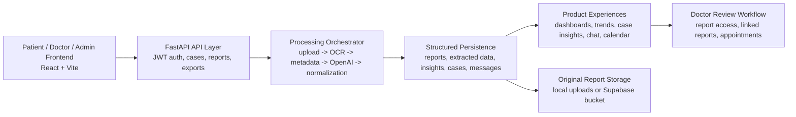

# DoctorCopilot

AI-assisted healthcare platform for patients, doctors, and administrators. DoctorCopilot turns uploaded medical reports into structured health data, trend summaries, case workflows, report access controls, real-time chat, and appointment-ready clinical context.

Live product: [doctorcopilot.app](https://www.doctorcopilot.app/)

## What This Project Does

DoctorCopilot is built around one core idea:

- Upload a report once.
- Process it once.
- Store the extracted medical intelligence.
- Reuse that stored data across dashboards, trends, insights, exports, and case review.

That design keeps the product faster, cheaper, and easier to reason about than a system that reruns AI on every page load.

## Product Surfaces

### Patient Portal

- Upload medical reports
- View dashboard, timeline, trends, cases, chats, calendar, and settings
- Request consultation with a doctor
- Approve or deny report access requests
- Export AI health summaries

### Doctor Portal

- Review pending consultation requests
- Accept, reject, refer, or open cases
- Inspect patient-wide trends and anomalies
- Request access to linked reports
- Open AI summaries and original files
- Chat with patients and schedule appointments

### Admin Portal

- Monitor platform activity
- Manage doctors, patients, cases, and reports
- Maintain operational visibility across the system
- Turn platform AI on or off to control cost
- Re-enable platform AI with an admin password gate
- Allow or block personal API key usage for specific patients

## Tech Stack

### Frontend

- React
- Vite
- Tailwind CSS
- Framer Motion
- SWR

### Backend

- FastAPI
- Async SQLAlchemy
- JWT authentication
- WebSocket case chat
- Pydantic

### AI And Processing

- OCR with `pypdf`, `pdfplumber`, `pdf2image`, `pypdfium2`, `pytesseract`
- OpenAI structured extraction
- Clinical normalization and report classification
- Trend and anomaly generation

### Storage And Deployment

- Local SQLite or PostgreSQL
- Local uploads and optional Supabase storage support
- Vercel for frontend deployment
- Railway for backend deployment

## Architecture



## End-To-End Flow

1. A patient logs in with a public ID.
2. The patient uploads a report.
3. The backend stores the file and starts processing.
4. OCR or direct extraction reads report text.
5. Metadata is extracted from the raw report.
6. OpenAI converts the report into structured medical JSON.
7. Clinical normalization repairs and standardizes values.
8. Structured results are saved to the database.
9. Patient and doctor portals reuse those stored results for dashboards, trends, and case review.
10. A doctor can accept the consultation, request report access, open linked reports, chat, and schedule appointments.

## AI Cost Control And Demo Mode

DoctorCopilot now supports a cost-control mode designed for demos and low-cost deployments.

- Admin can disable platform AI from the admin dashboard.
- When platform AI is disabled, the app enters demo mode.
- In demo mode, users can optionally provide their own OpenAI API key for the current browser session only.
- The session API key is never written to the database and is removed automatically on logout.
- Demo patient `P-10005` is blocked from using a personal API key and must create a new patient profile first.
- Admin can allow or block personal API key usage per patient account.
- If platform AI is enabled and the backend has a valid `OPENAI_API_KEY`, users do not need to enter any personal key.

### Patient Data Controls

- Patients can clear all of their stored reports, consultations, chats, appointments, and derived trend/insight data from the patient settings page.
- The patient account and login remain active after a data clear.
- Reports can also be deleted individually from the reports area.

## Repository Layout

```text
Doctorcopilot_finale
├─ app/                     FastAPI backend
│  ├─ api/                  REST endpoints
│  ├─ core/                 config, security, exceptions
│  ├─ db/                   database setup and schema helpers
│  ├─ models/               SQLAlchemy models
│  ├─ schemas/              request and response schemas
│  ├─ scripts/              seed and migration scripts
│  ├─ services/             AI, OCR, cases, reports, storage
│  └─ websockets/           real-time chat handling
├─ src/                     React frontend
├─ guide/                   project notes, credentials, architecture docs
├─ storage/                 uploaded files and local storage paths
├─ tests/                   backend tests
├─ package.json             frontend scripts
├─ requirements.txt         backend dependencies
├─ .env.example             sample environment configuration
├─ vercel.json              frontend deployment config
└─ railway.toml             backend deployment config
```

## Quick Start

### 1. Clone The Project

```bash
git clone <your-repo-url>
cd Doctorcopilot_finale
```

### 2. Frontend Setup

Install frontend dependencies:

```bash
npm install
```

Run the Vite frontend:

```bash
npm run dev
```

Frontend default URL:

```text
http://localhost:5173
```

### 3. Backend Setup

Create and activate a Python virtual environment:

```bash
python -m venv .venv
```

Windows PowerShell:

```powershell
.venv\Scripts\Activate.ps1
```

Install backend dependencies:

```bash
pip install -r requirements.txt
```

Run the FastAPI backend:

```bash
uvicorn app.main:app --reload --host 127.0.0.1 --port 8000
```

Backend default URL:

```text
http://127.0.0.1:8000
```

Health check:

```text
http://127.0.0.1:8000/health
```

## Environment Setup

Copy the sample file:

```bash
copy .env.example .env
```

Minimum variables you must set:

- `SECRET_KEY`
- `OPENAI_API_KEY`

Important notes:

- The repo supports SQLite for the easiest local setup.
- You can switch to PostgreSQL later by updating `DATABASE_URL`.
- `VITE_API_BASE_URL` should point to your backend URL.
- Supabase variables are optional unless you want remote storage.

Production or demo-mode related variables:

- `SUPABASE_URL`
- `SUPABASE_SERVICE_ROLE_KEY`
- `SUPABASE_STORAGE_BUCKET`
- `ADMIN_SEED_CODE`
- `ADMIN_SEED_EMAIL`
- `ADMIN_SEED_PASSWORD`

## Recommended Local `.env`

For the smoothest first run, use SQLite locally:

```env
APP_NAME=DoctorCopilot Backend
ENVIRONMENT=development
API_V1_PREFIX=/api/v1
VITE_API_BASE_URL=http://127.0.0.1:8000
DATABASE_URL=sqlite+aiosqlite:///./doctorcopilot.db
SECRET_KEY=replace-with-a-long-random-string
ACCESS_TOKEN_EXPIRE_MINUTES=120
OPENAI_API_KEY=your-openai-key
OPENAI_MODEL=gpt-4o-2024-08-06
UPLOAD_DIR=storage/uploads
MAX_UPLOAD_SIZE_MB=25
CORS_ORIGINS=["http://localhost:3000","http://localhost:5173"]
```

## Demo Data For Local Development

Seed doctors:

```bash
python -m app.scripts.seed_doctors
```

Seed patients, sample cases, messages, and sample reports:

```bash
python -m app.scripts.seed_sample_cases
```

Seeded local patient credentials currently created by the script:

- `P-20001` / `demo123`
- `P-20002` / `demo123`

Seeded doctor credentials:

- `D-10001` / `demo123`
- `D-10002` / `demo123`
- `D-10003` / `demo123`
- `D-10004` / `demo123`
- `D-10005` / `demo123`
- `D-10006` / `demo123`

Credential reference files are also written to:

- `guide/sample_patient_credentials.txt`
- `guide/doctors_credentials.txt`

## Newcomer Run Guide

If you are opening this project for the first time, use this order:

1. Clone the repository.
2. Copy `.env.example` to `.env`.
3. Change `DATABASE_URL` to SQLite for the easiest start.
4. Add your `SECRET_KEY` and `OPENAI_API_KEY`.
5. Install backend requirements.
6. Install frontend dependencies with `npm install`.
7. Start the backend with `uvicorn app.main:app --reload`.
8. In a second terminal, start the frontend with `npm run dev`.
9. Seed demo data with `python -m app.scripts.seed_sample_cases`.
10. Open `http://localhost:5173`.

## OCR Requirements

DoctorCopilot can read text directly from PDFs, but OCR fallback relies on external tooling.

Recommended local installs:

- Tesseract OCR
- Poppler

If OCR is unavailable, scanned PDF extraction may fail even though direct text PDFs still work.

## Common Commands

Frontend dev:

```bash
npm run dev
```

Frontend build:

```bash
npm run build
```

Frontend preview:

```bash
npm run preview
```

Run backend:

```bash
uvicorn app.main:app --reload
```

Seed doctors:

```bash
python -m app.scripts.seed_doctors
```

Seed sample patients and cases:

```bash
python -m app.scripts.seed_sample_cases
```

Run tests:

```bash
pytest
```

## API Highlights

### Auth

- `POST /api/v1/auth/register/patient`
- `POST /api/v1/auth/register/doctor`
- `POST /api/v1/auth/login`
- `GET /api/v1/auth/me`

### Reports

- `POST /api/v1/reports/upload`
- `GET /api/v1/reports/{report_id}`
- `GET /api/v1/reports/{report_id}/original`
- `POST /api/v1/reports/{report_id}/export`

### Patient

- `GET /api/v1/patients/me/profile`
- `GET /api/v1/patients/me/trends`
- `GET /api/v1/patients/me/insights`
- `GET /api/v1/patients/me/appointments`
- `DELETE /api/v1/patients/me/data`

### Doctor

- `GET /api/v1/doctors/me/profile`
- `GET /api/v1/doctors/dashboard`
- `GET /api/v1/doctors/cases`
- `GET /api/v1/doctors/cases/{case_id}`

### Admin

- `GET /api/v1/admin/ai-control`
- `PATCH /api/v1/admin/ai-control`
- `PATCH /api/v1/admin/patients/{patient_id}/ai-access`

### System

- `GET /api/v1/system/ai-access`

### Cases And Chat

- `POST /api/v1/cases`
- `PATCH /api/v1/cases/{case_id}`
- `GET /api/v1/cases/{case_id}/messages`
- `WS /ws/cases/{case_id}`

## Deployment Notes

### Frontend

- Built with Vite
- Configured for Vercel deployment

### Backend

- Built with FastAPI
- Configured for Railway deployment

### Storage

- Local file storage works in development
- Supabase storage can be enabled for production-like report storage

## Why This Project Matters

DoctorCopilot is not just an OCR demo and not just a dashboard skin.

It combines:

- full-stack product engineering
- AI-assisted medical data extraction
- structured persistence
- doctor and patient workflow design
- realtime communication
- cloud deployment thinking

In practical terms, it turns raw medical reports into a reusable health workflow system.
